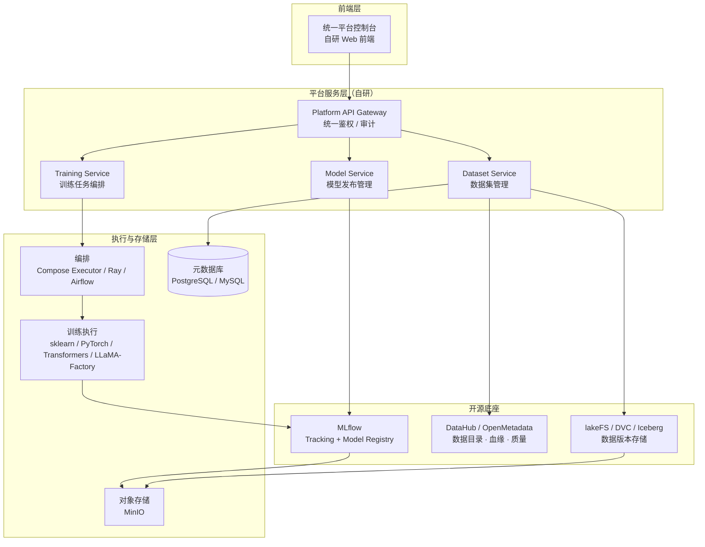
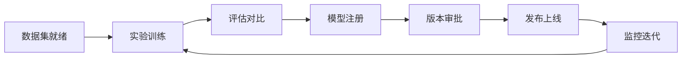
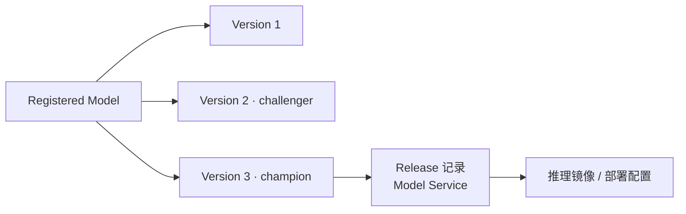
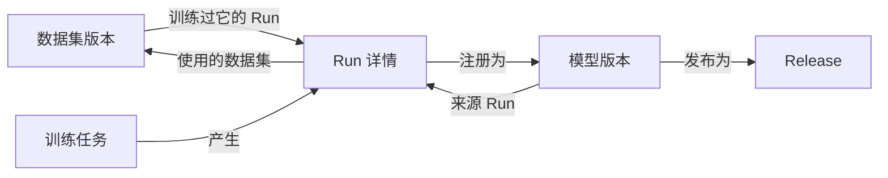

# 机器学习平台总体设计文档

> 版本：v0.1（草案）
> 日期：2026-07-03
> 状态：评审中

---

## 1. 背景与目标

### 1.1 背景

团队需要一个统一的机器学习平台，覆盖从数据集管理、实验训练、模型版本管理到发布上线的完整生命周期。平台需要同时支撑三类差异很大的建模场景：

- **传统机器学习**：KMeans、XGBoost、LightGBM、sklearn 分类/回归、MSTL 等时序分解方法
- **深度学习**：LSTM、CNN、Transformer 等中小规模神经网络
- **大模型微调**：Qwen、Llama 等 LLM 的 SFT/LoRA/DPO 微调，以及 Embedding/Rerank 模型训练

前期已通过 `platform_eval` 验证：MLflow 能够胜任实验追踪、模型注册、版本别名（champion/challenger）、数据集血缘记录等核心能力，且其 REST API 足以支撑自研前端替换官方 UI。

### 1.2 设计原则

1. **开源工具搭配 + 平台层自研**：不从零造轮子，成熟能力接开源组件，平台只自研产品层与集成层。
2. **模型类型与平台职责解耦**：训练框架按模型类型选择，平台统一管的是元数据、版本与流程，而非训练本身。
3. **MLflow 作为模型生命周期唯一事实源**：所有实验、模型版本、评估结果最终收敛到 MLflow。
4. **Fail fast**：集成层不做无休止的 fallback，依赖不可用时明确报错，避免状态不一致。
5. **前端统一自研**：面向业务用户提供统一控制台，屏蔽底层多个开源系统的差异。


### 1.3 非目标（Out of Scope）

- 不自研训练框架、不自研分布式训练调度内核（复用 Ray/Airflow 等）。
- 不自研数据目录/血缘/质量引擎（接 DataHub 或 OpenMetadata）。
- 平台一期不做在线特征平台（Feature Store），仅预留 `feature_view` 数据集类型作为衔接点。

---


## 2. 名词解释

| 名词 | 解释 |
| --- | --- |
| Experiment | MLflow 中的实验集合，按业务域/项目组织一组训练 Run。 |
| Run | 一次训练或评估执行，记录参数、指标、artifact、数据集输入和运行标签。 |
| Registered Model | MLflow Model Registry 中的业务模型实体，一个模型下可以有多个版本。 |
| Model Version | Registered Model 的一个具体版本，通常由一次达标 Run 注册生成。 |
| Alias | MLflow 的模型版本别名，用于表达 `champion`、`challenger` 等发布状态。 |
| Release | 平台层的发布记录，包含模型版本、推理配置、审批记录和部署目标。 |
| Dataset | 平台统一的数据集抽象，包含类型、版本、owner、标签、存储位置和训练可用性。 |
| Dataset Version | 数据集的不可变版本，绑定 checksum、schema、存储 URI 和质量报告。 |
| Artifact | 训练过程产出的文件或目录，例如模型文件、评估报告、特征重要性、checkpoint。 |
| Base Model | 大模型微调所依赖的基础模型权重，例如 Qwen、Llama。 |
| Adapter | LoRA/PEFT 等微调产物，可与 Base Model 组合形成可部署模型。 |
| Champion | 当前生产推荐版本，对应 MLflow 中的 `champion` alias。 |
| Challenger | 灰度或候选版本，对应 MLflow 中的 `challenger` alias。 |

---


## 3. 设计目标与非目标

### 3.1 设计目标

1. **统一模型生命周期入口**：通过自研前端与平台服务，把数据集、训练、实验、注册、审批、发布串成一个可追踪流程。
2. **复用成熟开源底座**：实验追踪和模型注册优先使用 MLflow，数据目录/治理优先对接 DataHub 或 OpenMetadata，数据版本能力按存储形态接 lakeFS、DVC 或 Iceberg。
3. **兼容多类模型训练**：同一套平台抽象同时支持传统机器学习、深度学习和大模型微调，但不要求训练框架统一。
4. **保证血缘与可回溯性**：模型版本必须能追溯到训练 Run、输入数据集版本、训练参数、评估指标和发布记录。
5. **AI-native 设计**：平台能力优先包装为可组合、可自动化调用的 CLI/API，便于 Agent 编排训练、评估、注册和发布流程；UI/UX 作为可选的人机协作入口，而不是唯一操作面。
6. **降低业务使用成本**：业务用户只面对平台控制台和统一 API，不需要理解 MLflow、DataHub、对象存储等底层系统差异。

### 3.2 非目标

1. **不自研训练框架**：平台不替代 sklearn、PyTorch、Transformers、LLaMA-Factory 等训练工具。
2. **不自研通用调度内核**：分布式训练、资源调度、任务编排复用 Ray、Airflow 或既有任务系统。
3. **不自研数据治理平台**：数据目录、跨系统血缘、schema 管理、质量规则和业务术语复用 DataHub/OpenMetadata。
4. **一期不建设在线特征平台**：仅在数据集类型中预留 `feature_view`，不实现在线特征读取与低延迟服务。
5. **不把前端做成底层工具拼盘**：用户入口保持统一，底层工具能力通过平台抽象暴露。

---


## 4. 设计思路与折衷

### 4.1 平台层自研，底座层复用

平台只自研产品层和集成层：统一前端、Dataset Service、Training Service、Model Service、鉴权审计和审批流程。实验追踪、模型注册、数据目录、数据版本、任务编排等能力优先复用开源或既有系统。

折衷点是平台需要维护跨系统一致性，但收益是避免重造 MLflow/DataHub/lakeFS/Ray 这类复杂系统，把工程投入集中在业务流程和用户体验上。

### 4.2 MLflow 作为模型生命周期事实源

实验、模型版本、指标、artifact 和模型 alias 收敛到 MLflow。平台服务不复制一份模型注册表，只在 MLflow 之上补充审批、发布、权限和业务视图。

折衷点是部分平台能力会受 MLflow 数据模型约束；但这样能减少双写和状态分裂，模型版本的事实源更清晰。

### 4.3 与 W&B 等实验工具的协作边界

平台不把 W&B 这类实验协作工具作为模型生命周期事实源。W&B 可以用于训练过程可视化、实验协作、曲线对比和团队讨论，但模型注册、版本状态、发布审批和生产 alias 仍以 MLflow + Model Service 为准。

折衷点是研究团队可以继续使用熟悉的实验工具，但平台需要定义清楚同步边界：W&B Run ID、报告链接、关键指标可以作为 MLflow tag 或 artifact 引用沉淀；反向不依赖 W&B 状态驱动发布，避免生命周期状态分裂。

### 4.4 数据集服务只做平台抽象

Dataset Service 不替代 DataHub/OpenMetadata，也不替代底层数据版本系统。它负责把业务可理解的数据集、版本、可训练状态、审批和权限包装成平台 API，并与 MLflow Run 建立关联。

折衷点是底层元数据仍分布在多个系统中；但平台可以用稳定的数据集 ID 和版本号把训练侧体验统一起来。

### 4.5 大模型权重用引用，轻量产物进 artifact

大模型 base/merged 权重通常体积很大，不直接塞进 MLflow artifact。平台在 MLflow 中记录 MinIO 对象 URI、checksum 和版本信息，adapter、评估报告、配置文件等轻量产物可直接作为 artifact 管理。

折衷点是发布链路需要校验 MinIO 对象的可用性和完整性；但可以显著降低 MLflow artifact 存储压力。

### 4.6 前端统一，自研但不隐藏关键事实

前端作为唯一用户入口，屏蔽底层工具差异；但关键事实仍要可追溯，例如 Run ID、模型版本、数据集版本、artifact URI、审批记录和发布目标。

折衷点是前端需要做更多聚合视图；但用户不需要在多个工具之间切换，操作链路更短。

### 4.7 模块边界不等于镜像边界

Dataset、Training、Model 等能力在代码中保持清晰模块边界，但一期不按模块拆成多个自研 Docker 镜像。自研部分优先收敛为一个 `cortex-app` 镜像，内部包含 API、CLI 和核心 service modules；外部依赖系统仍按各自官方部署形态运行。

折衷点是单镜像会让应用内部边界更依赖工程纪律，但可以避免过早微服务化、镜像数量膨胀和部署复杂度上升。只有当某个模块出现独立扩缩容、独立权限域、重依赖隔离或独立发布节奏时，再拆分为单独镜像。

---


## 5. 总体架构


### 5.1 架构分层




### 5.2 职责划分


| 组件                     | 类型  | 职责                                            |
| ---------------------- | --- | --------------------------------------------- |
| MLflow                 | 开源  | 实验追踪、参数/指标/artifact 记录、模型注册表、版本别名、训练输入血缘      |
| Dataset Service        | 自研  | 数据集抽象、版本、owner、标签、审批、权限、训练可用性、与 MLflow Run 关联 |
| DataHub / OpenMetadata | 开源  | 数据目录、跨系统血缘、搜索、schema 管理、数据质量、业务术语、治理          |
| lakeFS / DVC / Iceberg | 开源  | 数据物理版本：分支、commit、快照、回滚（按存储形态选型，见 §7.4）        |
| Training Service       | 自研  | 训练任务提交、模板管理、资源配额、状态跟踪，对接编排系统                  |
| Model Service          | 自研  | 模型发布流程、审批、base model + adapter 管理、推理镜像关联      |
| 统一前端                   | 自研  | 面向用户的唯一入口，聚合以上所有能力                            |


**核心取舍**：DataHub/OpenMetadata 已覆盖目录、血缘、搜索、owner、治理等能力，自研这些会很重且形成长期维护负担；平台自研只聚焦在"产品层抽象 + 与 MLflow 的打通"。

---


## 6. 模型生命周期管理


### 6.1 生命周期阶段




| 阶段   | 承载系统                  | 说明                                       |
| ---- | --------------------- | ---------------------------------------- |
| 实验训练 | MLflow Tracking       | 每次训练一个 Run，记录参数、指标、artifact、数据集血缘        |
| 评估对比 | MLflow + 平台前端         | 指标对比、评估样本回放、champion/challenger 对比       |
| 模型注册 | MLflow Model Registry | 达标模型注册为 Registered Model 的新版本            |
| 版本审批 | Model Service（自研）     | 平台层审批流，通过后写 MLflow alias                 |
| 发布上线 | Model Service + 推理平台  | 按模型类型产出部署物（pyfunc / TorchServe / vLLM 等） |
| 监控迭代 | 推理平台 + MLflow         | 线上指标回流，触发再训练                             |


### 6.2 MLflow 使用约定

- **实验组织**：按 `{业务域}/{项目}` 命名 Experiment；Run 必须携带标准 tag：`model_type`、`dataset_version`、`task_type`、`owner`。
- **模型注册**：Registered Model 按业务模型命名（而非算法命名），一个业务模型下允许不同算法的版本并存。
- **版本别名**：使用 MLflow alias 管理状态，约定 `champion`（当前生产版本）、`challenger`（灰度候选）、`archived` 由删除 alias 表达。禁止使用已废弃的 stage 机制。
- **数据集血缘**：训练脚本必须调用 `mlflow.log_input()` 记录数据集来源，`dataset.name` 与 Dataset Service 的 `dataset_id@version` 对齐。


### 6.3 三类模型的差异化接入

平台通过统一的训练任务抽象接入三类模型，差异收敛在训练模板与产物类型上：

#### 传统机器学习（KMeans、XGBoost、MSTL 等）

- 训练：sklearn / xgboost / lightgbm / statsmodels，单机为主
- 跟踪：MLflow autolog + 手动补充业务指标
- 产物：pickle/ONNX 模型，pyfunc 包装后注册
- 数据集类型：`tabular`、`time_series`


#### 深度学习（LSTM、CNN、Transformer 小模型）

- 训练：PyTorch / TensorFlow，需 GPU，可能多卡
- 编排：Docker Compose 环境中的轻量执行器；后续按需求评估 Ray / Airflow / 自研任务系统提交
- 跟踪：MLflow 记录权重 checkpoint、loss 曲线、验证指标
- 产物：模型权重 + 推理代码，pyfunc 或 TorchServe 格式注册
- 数据集类型：`time_series`、`image`、`text` 等


#### 大模型微调（Qwen、Llama、Embedding/Rerank）

- 训练：Transformers / PEFT / LoRA / DeepSpeed / Accelerate / LLaMA-Factory
- 产物：**adapter、merged model、tokenizer、config 分别管理**
- 跟踪：MLflow 记录超参、loss、eval、checkpoint 引用、adapter artifact
- 模型来源：base model 可接 Hugging Face Hub / ModelScope / MinIO 私有仓库
- 发布：平台层管理 `base model + adapter version → merged version → 推理镜像` 的组合关系
- 数据集类型：`text_instruction`、`preference_pair`、`embedding_corpus`、`eval_set`

**LLM 特殊设计**：大权重文件（数十 GB）不直接作为 MLflow artifact 存储，MLflow 中记录 MinIO 对象 URI 引用 + checksum；adapter（通常几十 MB~几 GB）可直接作为 artifact。Model Service 维护 base/adapter/merged 的组合关系表。

### 6.4 模型发布模型




Model Service 在 MLflow 版本之上增加 **Release** 概念：一次发布 = 模型版本 + 推理配置 + 审批记录 + 部署目标。回滚即把 `champion` alias 指回旧版本并重新发布。

---


## 7. 数据集管理（Dataset Service）


### 7.1 定位

Dataset Service 是平台自研的核心服务，向上给前端提供统一的数据集产品抽象，向下对接数据版本存储（lakeFS/DVC/Iceberg）与数据目录（DataHub/OpenMetadata），横向与 MLflow Run 建立血缘关联。

### 7.2 数据集类型

数据集抽象必须通用，不能只面向表格数据。一期支持以下类型：


| type                        | 说明                                 | 典型消费方                |
| --------------------------- | ---------------------------------- | -------------------- |
| `tabular`                   | CSV、Parquet、数据库表                   | KMeans、XGBoost、传统 ML |
| `time_series`               | 时间序列                               | LSTM、MSTL、预测模型       |
| `image` / `audio` / `video` | 多模态原始数据                            | CV/语音模型              |
| `text_instruction`          | SFT 指令数据（instruction/input/output） | Qwen SFT             |
| `preference_pair`           | 偏好对数据（chosen/rejected）             | DPO/RLHF             |
| `embedding_corpus`          | 向量召回语料                             | Embedding/Rerank 训练  |
| `eval_set`                  | 评测集                                | 所有模型的评估环节            |
| `feature_view`              | 特征工程后的训练视图                         | 衔接未来 Feature Store   |


### 7.3 核心数据模型

```
Dataset
├── datasetId          全局唯一 ID
├── name / description
├── type               见 §7.2
├── owner / team
├── labels / tags
├── status             draft / active / deprecated / archived
├── visibility         权限范围（private / team / public）
└── versions[]
    ├── version            语义化版本或递增号
    ├── schema             字段定义（tabular）或样本结构定义（LLM 数据）
    ├── storageUri         物理位置（Phase 1 为 MinIO 对象 URI，格式兼容 s3://bucket/path）
    ├── format             parquet / jsonl / csv / ...
    ├── rowCount / sampleCount
    ├── checksum           内容摘要，保证可复现
    ├── split              train / val / test 划分方式与比例
    ├── qualityReport      质量检测结果引用
    ├── approvalStatus     pending / approved / rejected
    ├── trainable          审批通过后才可用于训练
    ├── createdBy / createdAt
    └── linkedMlflowRuns[] 消费此版本的 Run 列表（双向血缘）
```


### 7.4 数据版本存储选型

当前阶段只使用 MinIO 作为对象存储，Dataset Service 不抽象多存储后端。`storageUri` 使用 `s3://bucket/path` 形式是因为 MinIO 兼容 S3 协议，不表示支持 AWS S3 或 OSS。


| 场景                               | 选型                          | 理由                                               |
| -------------------------------- | --------------------------- | ------------------------------------------------ |
| Phase 1 数据集与 artifact 存储 | **MinIO** | Compose 内置，部署简单，兼容 MLflow artifact 存储 |
| 后续需要数据分支/回滚/复现 | lakeFS on MinIO | 在 MinIO 之上提供 branch/commit/merge/快照能力 |


**Phase 1 默认路径**：数据集文件上传或登记到 MinIO，`storageUri` 记录 MinIO 对象位置，checksum 用于复现校验。lakeFS/DVC/Iceberg 暂不进入当前实现。

### 7.5 与 MLflow 的血缘打通

1. 训练任务启动时，Training Service 将 `datasetId@version` 注入训练上下文。
2. 训练脚本通过平台 SDK 调用 `mlflow.log_input()`，dataset name 携带 `datasetId@version`，digest 使用版本 checksum。
3. 训练完成后，平台以回调/事件方式在 Dataset Service 中反向登记 `linkedMlflowRuns`。
4. 前端可从任一侧导航：数据集版本 → 训练过它的所有 Run/模型版本；模型版本 → 它使用的数据集版本。


### 7.6 与 DataHub/OpenMetadata 的分工

- Dataset Service 管**平台内产品抽象**：审批、训练可用性、与 Run 的关联、面向训练场景的版本。
- DataHub/OpenMetadata 管**企业级元数据**：跨数据源目录、上游 ETL 血缘、schema 变更、数据质量规则、业务术语。
- Dataset Service 将数据集元数据同步注册到目录系统（单向推送），前端在数据集详情页嵌入目录系统的血缘/质量视图链接。


### 7.7 数据质量

- 表格/时序数据：接 Great Expectations 或 Soda，质量报告结果写入版本的 `qualityReport`。
- LLM 数据（instruction/preference）：平台内置轻量校验（格式合法性、去重率、长度分布、敏感词），报告同样挂到版本上。
- 质量检测失败的版本不允许 `approvalStatus=approved`，即不可用于训练（fail fast，不做降级放行）。

---


## 8. 训练任务管理（Training Service）


### 8.1 职责

- 训练模板管理：按模型类型预置模板（sklearn 单机 / PyTorch 分布式 / LLaMA-Factory 微调），模板声明镜像、资源规格、参数 schema。
- 任务提交与状态跟踪：提交到底层执行器（一期先用 Docker Compose 环境中的本机/容器任务执行器），跟踪 pending/running/succeeded/failed。
- 上下文注入：自动注入 MLflow tracking URI、experiment、数据集版本、平台标准 tag。
- 资源与配额：按 team 维度做 GPU/CPU 配额（一期可简化为软限制）。


### 8.2 训练任务与 MLflow 的关系

- 一个训练任务（Job）对应一个或多个 MLflow Run（如超参搜索为一对多）。**Phase 1 显式简化为 1:1**，一对多场景（超参搜索）随 Phase 2 引入，届时以 Job-Run 关联表替代单值字段。
- Run 由 Training Service 在训练启动前预创建并注入训练环境，训练脚本复用该 Run，避免脚本早期崩溃产生孤儿 Run。
- Job 记录存平台元数据库，包含 Run 关联；Run 的 tag 中反向记录 `platform.jobId`。
- 训练日志（stdout）由编排系统收集，前端通过 Training Service 代理查看；指标曲线直接读 MLflow。

---


## 9. 前端设计

统一自研控制台，替换 MLflow 官方 UI（已在 `platform_eval/frontend` 验证读取 MLflow 数据渲染的可行性）。

### 9.1 信息架构

顶层导航 5 个模块，按"资产 + 活动"组织：**数据集、模型**是资产型模块（管的是有版本的东西），**训练、实验、发布**是活动型模块（管的是过程与流程）。这与 Azure ML Studio（Data / Jobs / Models / Endpoints 等约 9 项）、Vertex AI（Datasets / Training / Experiments / Model Registry / Endpoints 等 10+ 项）的组织方式一致；业界主流平台顶层导航普遍在 6~10 项，5 个模块不算多，后续接入目录搜索、监控后还会自然增长。

模块间不靠导航合并来关联，而是靠**详情页交叉链接**串成血缘闭环：




"训练"和"实验"容易混淆，约定为：**训练模块回答"我提交的任务跑得怎么样"（面向执行：状态、日志、资源），实验模块回答"哪组参数效果好"（面向结果：指标、对比、图表）**。训练任务详情页一键跳转到对应 Run，反之亦然。

### 9.2 页面明细


#### 数据集模块（Dataset Service）


| 页面          | 核心内容与交互                                                                                          |
| ----------- | ------------------------------------------------------------------------------------------------ |
| 数据集列表       | 按 type / owner / team / tag / status 筛选；搜索；创建入口                                                  |
| 数据集详情       | 基本信息、版本列表（版本号、checksum、rowCount、trainable 状态）、schema 展示；LLM 类数据集展示样本预览（instruction/output 抽样若干条） |
| 版本详情        | schema、split 比例、storageUri、质量报告（Phase 3）、**消费此版本的 Run/模型版本列表**（血缘出边）                             |
| 版本对比        | 两个版本间 schema diff、行数变化、样本量变化                                                                     |
| 创建/登记版本     | 上传文件或登记已有 MinIO 对象路径，自动计算 checksum，填写 split 与说明                                                |
| 审批（Phase 2） | 待审批版本队列，审批通过/驳回附意见                                                                               |


#### 实验模块（MLflow，经网关代理）


| 页面     | 核心内容与交互                                                                    |
| ------ | -------------------------------------------------------------------------- |
| 实验列表   | 按业务域/项目分组的 Experiment 列表，展示 Run 数、最近活跃时间                                   |
| Run 列表 | 表格视图：参数列、指标列可自定义显示与排序；按 tag（model_type / dataset_version / owner）筛选；多选进入对比 |
| Run 详情 | 参数、指标曲线（loss/eval 随 step）、artifact 浏览、数据集输入（血缘入边）、来源训练任务链接、"注册为模型版本"操作入口   |
| Run 对比 | 多 Run 并排：参数 diff 高亮、指标曲线叠加、平行坐标图                                           |


#### 训练模块（Training Service）


| 页面        | 核心内容与交互                                                                                              |
| --------- | ---------------------------------------------------------------------------------------------------- |
| 任务提交      | 三步表单：选模板（sklearn / PyTorch / LLaMA-Factory）→ 选数据集版本（只列 trainable 的）→ 按模板参数 schema 动态渲染参数表单；提交前显示资源规格 |
| 任务列表      | 状态筛选（pending/running/succeeded/failed）、按 team/owner 过滤、失败原因摘要                                        |
| 任务详情      | 实时日志（WebSocket/轮询）、资源占用、关联 Run 链接、失败重试（复用原参数）                                                        |
| 模板管理（管理员） | 模板的镜像、资源规格、参数 schema 维护                                                                              |


#### 模型模块（MLflow + Model Service）


| 页面                     | 核心内容与交互                                                                        |
| ---------------------- | ------------------------------------------------------------------------------ |
| 模型注册表                  | 业务模型列表，展示当前 champion 版本、版本总数、owner                                             |
| 模型详情                   | 版本时间线（哪个版本何时成为 champion）、alias 状态一览                                            |
| 版本详情                   | 指标快照、来源 Run 链接、使用的数据集版本、artifact；LLM 模型额外展示 base model + adapter 组合关系（Phase 2） |
| champion/challenger 对比 | 两版本指标并排、评估样本回放对比                                                               |


#### 发布模块（Model Service，Phase 2）


| 页面         | 核心内容与交互                           |
| ---------- | --------------------------------- |
| Release 列表 | 发布历史：版本、审批人、时间、状态、部署目标            |
| 发起发布       | 选模型版本 + 推理配置，进入审批流                |
| 审批         | 审批队列，通过后系统自动切 alias               |
| 回滚         | 选择历史 Release 一键回滚，生成新的 Release 记录 |


### 9.3 技术方案

- **技术栈**：React + TypeScript，组件库选一个成熟体系（如 Ant Design）；图表用 ECharts（指标曲线、平行坐标）。
- **BFF 聚合**：前端不直连 MLflow，统一走平台 API Gateway。跨系统页面（如版本详情要同时聚合 MLflow 指标 + Dataset Service 血缘 + Model Service Release 状态）由网关层 BFF 接口聚合，避免前端串行调用多个后端。
- **鉴权与审计**：网关统一做登录态校验、team 级数据过滤、写操作审计。
- **实时性**：训练日志与任务状态用 WebSocket（或降级轮询）；其余页面常规请求 + 前端缓存。
- **分期**：与 Phase 1 详细设计对齐，**Phase 1 的前端为可选交付**（CLI/API first，UI 不是闭环必需依赖）；若实现，范围为数据集（无审批）、实验、训练、模型四个模块的轻量页面。发布模块与审批类页面随 Phase 2 交付。

---


## 10. 权限与多租户

- 平台层统一账号体系（对接企业 SSO/LDAP），资源归属到 team。
- Dataset Service：数据集级 visibility + 操作权限（read / write / approve）。
- MLflow 本身权限能力弱，通过网关代理实现 experiment/model 级的访问控制（按 tag/naming 约定映射到 team）。
- 审计：所有写操作（数据集审批、模型发布、alias 变更）在网关层记录审计日志。

---


## 11. 部署形态

一期采用 **Docker Compose + 一个自研核心应用镜像 + 多个外部依赖容器** 的部署方式。代码可以按 Dataset、Training、Model 模块组织，但部署上先合并为 `cortex-app`，避免在系统尚未复杂到需要微服务化之前引入过多镜像和运维面。当前阶段只按 Compose 集群方案设计。

| 组件                             | 部署方式                  | 存储依赖                                |
| ------------------------------ | --------------------- | ----------------------------------- |
| cortex-app                     | Docker Compose service | PostgreSQL |
| MLflow Server                  | Docker Compose service | PostgreSQL（元数据）+ MinIO（artifact） |
| PostgreSQL                     | Docker Compose service | volume |
| MinIO                          | Docker Compose service | volume |
| DataHub 或 OpenMetadata         | 暂不纳入一期 Compose；Phase 3 前 PoC | 自带（ES/MySQL 等）                      |
| lakeFS                         | 暂不纳入一期 Compose；验证血缘闭环后再引入 | PostgreSQL + MinIO               |
| 前端                             | 可选；静态资源 + Nginx，或由 cortex-app 托管 | —                                   |
| 训练执行                           | cortex-app 内部执行器 / Compose 中的临时训练容器 | 本机 CPU/GPU 或容器运行时可见资源 |

`cortex-app` 内部包含：

- Platform API Gateway
- Dataset Service module
- Training Service module
- Model Service module
- AI-native CLI 入口

后续拆分镜像的触发条件：

- Training Service 引入明显重于其他模块的运行依赖，需要隔离镜像体积或安全面。
- Model Service 需要独立权限域、发布审批流程或更严格的变更控制。
- 某个模块需要独立扩缩容，且单体部署已经成为明确瓶颈。
- 某个模块形成稳定公共接口，需要被其他系统独立依赖。


---


## 12. 演进路线


### Phase 1：最小可用（模型生命周期 + 基础数据集）

详细设计见：[Phase 1 详细设计：最小可用机器学习平台](design/phase-1-detailed-design.md)。

建设内容：

- MLflow Server 生产化部署（PostgreSQL + MinIO）
- Dataset Service 一期：tabular / time_series / text_instruction 三类，版本 + checksum + 与 Run 关联，storage 直接用 MinIO 对象 URI。§7.3 中的 `approvalStatus` / `qualityReport` 字段预留但不启用，版本创建后默认 `trainable=true`
- Training Service 一期：sklearn 与 PyTorch 两类模板（`sklearn-kmeans` / `sklearn-classifier` / `sklearn-regressor` / `pytorch-basic`），通过 Docker Compose 环境中的本机/容器任务执行器提交。MSTL 等 statsmodels 时序模板不在 Phase 1 内置清单中，随 Phase 2 按需求补充
- 前端一期（可选交付）：实验、模型注册表、数据集列表、训练任务提交与日志查看

用户视角，Phase 1 结束时算法工程师可以：

1. **注册数据集**：在前端创建 tabular / time_series / text_instruction 数据集，上传或登记 MinIO 对象位置，得到 `datasetId@version` 和 checksum。
2. **提交训练**：选择数据集版本 + 训练模板（如 KMeans、分类/回归、PyTorch 基础模板），填参数提交任务，通过 CLI 或前端看任务状态和训练日志。
3. **查看实验**：训练自动产生 MLflow Run，前端对比多个 Run 的参数与指标曲线，Run 上能看到用的是哪个数据集版本。
4. **注册与切换模型版本**：把达标 Run 的模型注册为新版本，直接设置 `champion` / `challenger` alias（无审批，操作即生效），并能回滚 alias 到旧版本。
5. **双向血缘查询**：从数据集版本查到训练过它的 Run 和模型版本，反之亦然。

Phase 1 明确做不到：数据集审批与质量门禁（版本一创建即可训练）、模型发布审批（alias 切换无流程管控）、LLM 微调、数据物理版本回滚（MinIO 对象被覆盖则复现依赖 checksum 校验发现，而非恢复）、跨数据源目录搜索。

### Phase 2：LLM 微调与数据版本

建设内容：

- LLaMA-Factory 微调模板、base/adapter/merged 管理
- 接入 lakeFS，数据集版本升级为 lakeFS commit 引用
- preference_pair / embedding_corpus / eval_set 类型
- 模型发布审批流与 Release 管理（启用数据集与模型的 `approvalStatus`）

用户视角，Phase 2 结束时在 Phase 1 基础上新增：

1. **微调 Qwen 类大模型**：登记 base model（HF Hub / ModelScope / MinIO），准备 `text_instruction` 或 `preference_pair` 数据集，用 LLaMA-Factory 模板提交 SFT/LoRA/DPO 任务，MLflow 中查看 loss/eval 曲线。
2. **管理 adapter 组合**：在模型详情页看到某个模型版本 = 哪个 base model + 哪个 adapter 版本，merged model 以 MinIO 对象 URI 引用的形式关联。
3. **数据集版本真正可回滚**：数据集版本指向 lakeFS commit，历史版本内容不可变，任何时候都能精确复现某次训练的输入数据。
4. **走审批发布模型**：模型上线前发起 Release，审批通过后系统才写 `champion` alias；回滚操作同样留有 Release 记录。
5. **数据集审批门禁**：数据集版本需 owner/管理员审批为 `approved` 后才 `trainable`，未审批版本在训练提交页不可选。
6. **用统一评测集评估**：创建 `eval_set` 数据集，微调后的模型跑评测，结果记录在 MLflow 中与版本关联。

Phase 2 明确做不到：自动化数据质量检测（审批仍靠人工判断，Great Expectations / LLM 数据校验在 Phase 3 接入后审批才有质量报告支撑）、企业级目录搜索与跨系统血缘、资源硬配额。

### Phase 3：治理与规模化

- 接入 DataHub 或 OpenMetadata（二选一，先 PoC 后定型）
- 数据质量流水线（Great Expectations / 内置 LLM 数据校验）
- 配额、审计、多租户强化
- 线上监控指标回流与再训练触发

---


## 13. 风险与开放问题


| 风险/问题                      | 说明                    | 应对                                             |
| -------------------------- | --------------------- | ---------------------------------------------- |
| DataHub vs OpenMetadata 选型 | 两者能力重叠度高              | Phase 3 前做 PoC，评估维度：部署复杂度、connector 覆盖、API 易用性 |
| MLflow 权限薄弱                | 原生无细粒度权限              | 网关代理 + naming 约定；关注 MLflow 后续多租户特性             |
| 大权重存储成本                    | LLM checkpoint 体积大    | MLflow 只存 MinIO 引用；对象生命周期策略清理中间 checkpoint          |
| 编排系统选型                     | Docker Compose 执行器 vs Ray/Airflow | Phase 1 先用 Docker Compose 环境中的轻量执行器，Phase 2 按分布式训练需求再定        |
| lakeFS 引入成本                | 多一个有状态组件              | Phase 1 先用 MinIO 对象 URI + checksum，验证血缘闭环后再引入       |


---
